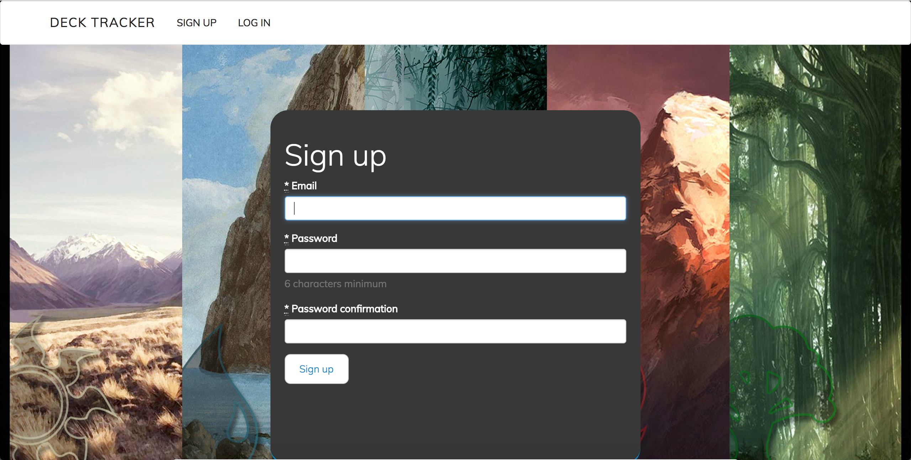
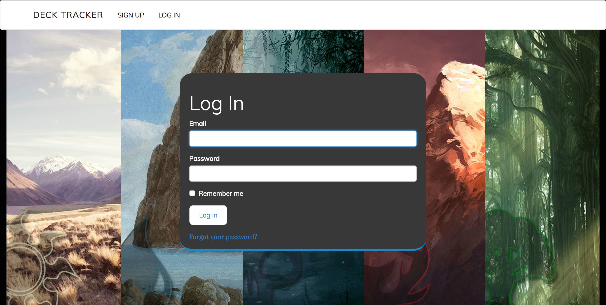
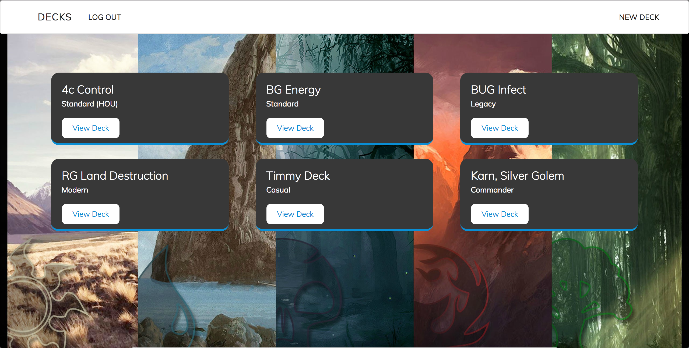
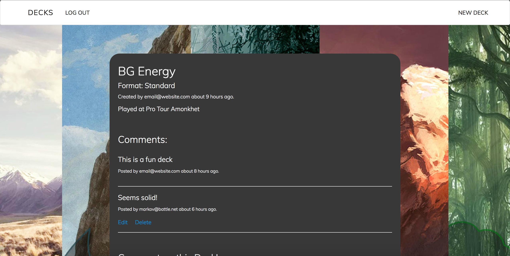
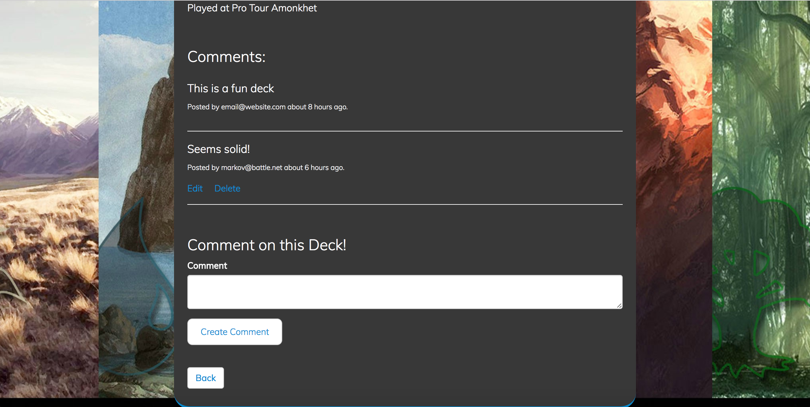
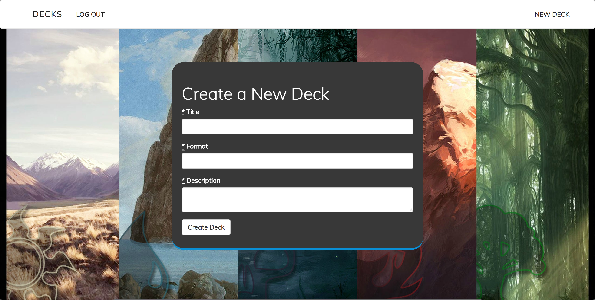

# README

Deck tracker app for Magic: the Gathering created with Ruby on Rails (Ruby version 2.4, Rails version 5.1.2).

Run 'bundle install' inside the root directory once cloned.

Database is SQLite3.

More to come later! 

# Screenshots:

